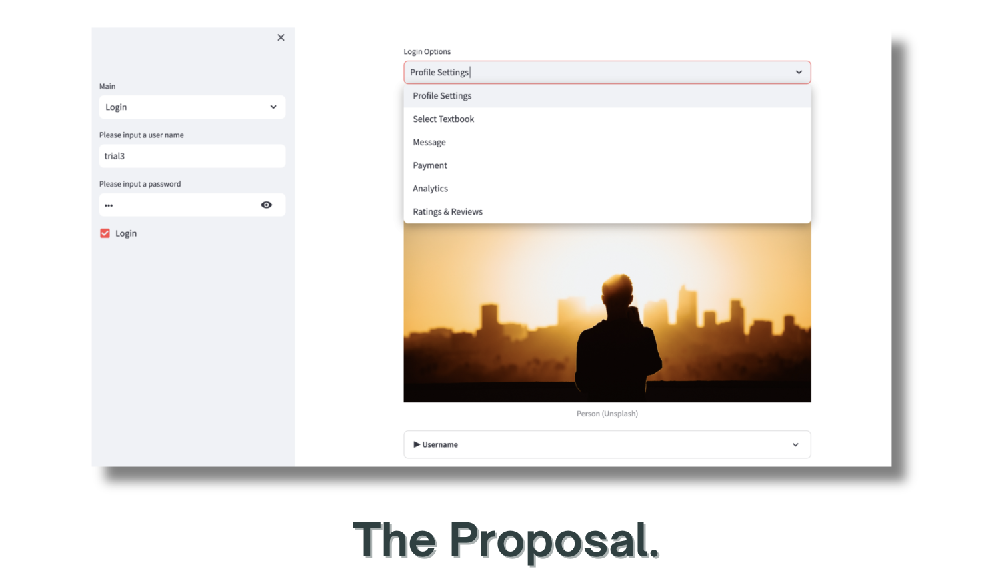

# Resale-Revolution
**Empower Hacks Hackathon Submission** 

--- 

‣ **Main Idea**: Web application that facilitates lending/borrowing & selling/purchasing of course textbooks, with some unique elements (involving gift cards, tracking analytics and more), to promote: 
- Learning for academic success, unburdened by financial concerns  
- A sense of belonging and community among low income students  
- Resource sharing  
- Initiative to help by creating incentives such as an opportunity for senior low income students to receive gift cards to purchase food, clothes and supplies by increasing their 'rank'  
- Reduction in the opportunity and time costs of finding cost-effective and budget-friendly books in libraries or platforms  
- And most importantly, help low income students feel valued in the community and have the ability to contribute  
- Reusing textbooks and reducing waste (also lowering printing costs)  

‣ **Devpost project** [page](https://devpost.com/software/resale-revolution)

‣ **Video Demo**: Click on the image below to find a video demo of the project: 

 

‣ To run the code on your device:  
- Install [DB Browser for SQLite](https://sqlitebrowser.org/) to find saved user signup information
- 

**Note**: Since the code is the result of a 48-hour hackathon challenge, there are certainly numerous ways to improve the code structure, security, and exception handling (to resolve errors in user input and more). This will be one of the important improvements I will be making in the future.

**Find the code [here](https://github.com/V-Mayya/python-sales-data-analysis/blob/main/code.py)**. Some data visualisations produced were:  
(i) [Monthly profit in 2018](https://github.com/V-Mayya/python-sales-data-analysis/blob/main/monthly%20profits.png) 
(ii) [Monthly sales and expenditures in 2018](https://github.com/V-Mayya/python-sales-data-analysis/blob/main/monthly%20sales%20and%20expenditures.png) 
(iii) [Monthly sales in 2018](https://github.com/V-Mayya/python-sales-data-analysis/blob/main/monthly%20sales.png) 
(iv) [Percentage change in sales over the months](https://github.com/V-Mayya/python-sales-data-analysis/blob/main/Percentage_change_in_sales.png)

‣ Further questions on project background:   

<b>What was this project built with?</b>

 
Coded from scratch and primarily used Python and Streamlit. Some packages used include numpy, pandas, matplotlib (and others such as time and random). Used SQLite to build a database to store user signup information and use it on other pages in the web app. Also used the os module as part of this. Incorporated a bit of HTML to make a few changes to the default structure. Started with a basic web app structure and then added further details. Coded in Visual Code.  

<b>Features and structure of web app</b>

 
Analytics: Buyers track the number of gift cards sent, their monthly savings by purchasing/borrowing textbooks on the web app, gain accomplishments/badges. Sellers/lenders track the number of books loaned/sold, receive badges and ranks (eg: for affordability, lending periods, textbook condition). Both can find out how many they lives were impacted (based on books sold/lent or gift cards sent). Sellers analytics page will be developed.  
Select Textbook: (buyer/borrower account) Find textbook matches based on users' backgrounds (eg: university or school and major). Specific seller/lender match after finding appropriate textbooks (textbook match) can be based on similar economic status of a seller/lender and buyer/borrower (the latter will be developed). Obtain images and features of the selected textbook (including textbook condition) and then make a choice to either buy or borrow it. Option to also send virtual gift cards to sellers/lenders.  
Ratings & Reviews: Leave ratings and constructive feedback on the seller's services, contributing to the seller's overall rank.  
Message: Message other users about receiving books, meeting times, locations and more. Connect with senior university or school students for support and general help. Create a sense of inclusivity - page will be developed.  
Profile Settings & Payments: Find profile details such as financial information and questions answered during signup.  The payments page can include the ability to connect to personal bank accounts, gift card providers and more - payments page will be developed. 

--- 

